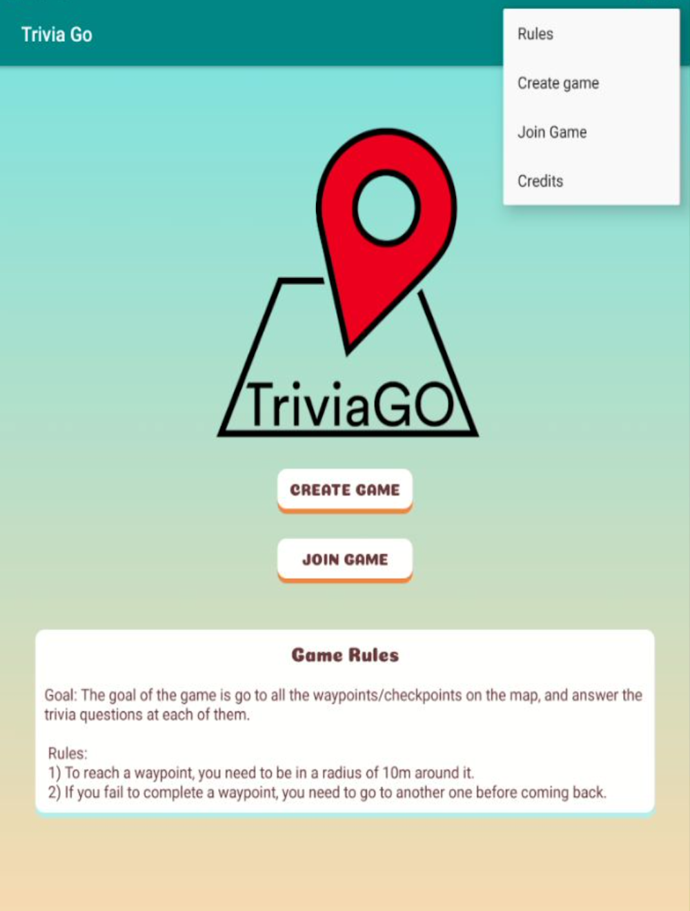
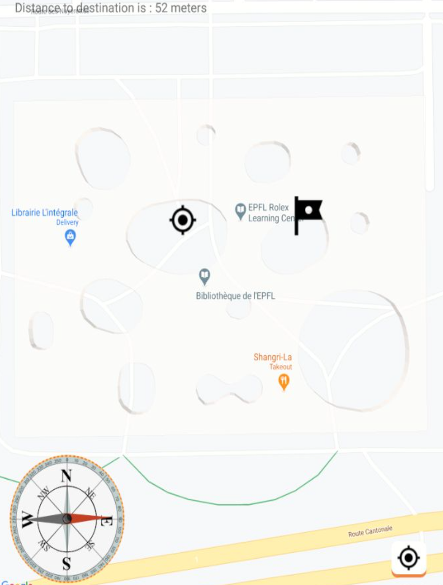
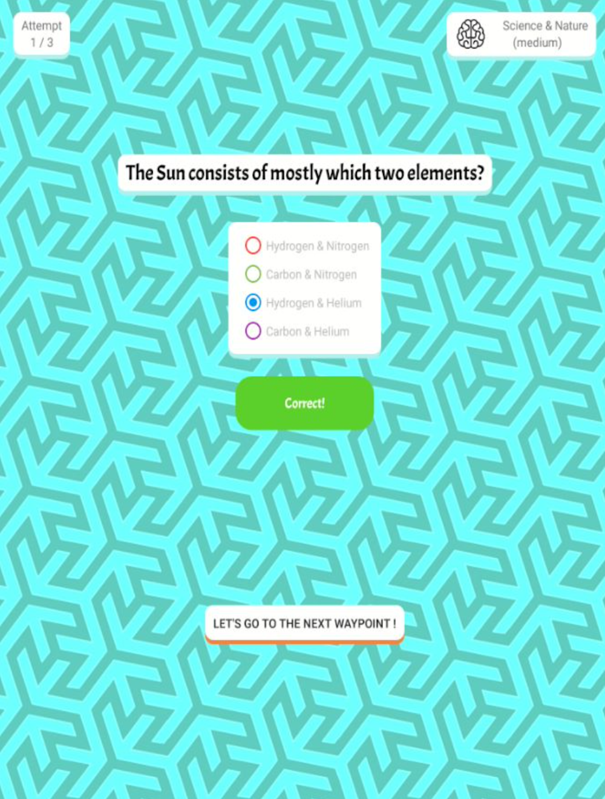
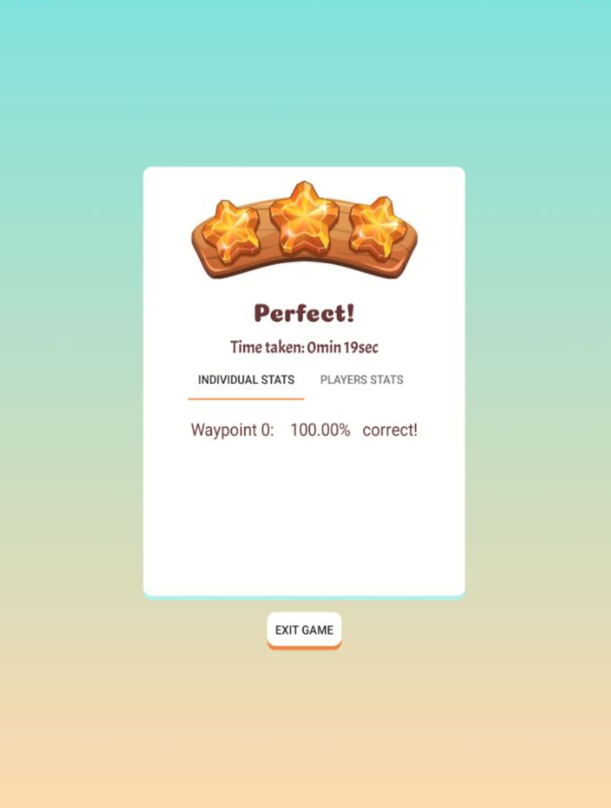

# Trivia Go

Trivia Go was a real world multiplayer game combining trivia and capture the flag.

You create your own map, placing waypoints and choosing trivia question categories for each. Then the people to which you give the name of the game, will be able to join and play. May the best one win !!

## Project files and instructions

In the github repository, you will find the following files and folders (non exhaustive) :

- **presentation.pdf** : our project slides to support the oral presentation of the project.

- **binaries/mobile.apk** : the android app, which you can install on any android phone/tablet

- **binaries/wear.apk** : the WearOS app, which you can install on any WearOS smart watch (using command line tools adb)

- **AndroidStudioProject** : the Android Studio project, which contains all source files. You can open this project (open settings.gradle) in Android Studio, and run/debug the Android and Wear app on any debug enabled device. 

- **extras/** : folder containing a PDF and a video presentation of the app.

This project uses Firebase Authentication and Realtime database, and the Google Maps API. As is, the project files should suffice to run and debug the app, but if not, please contact us so that we can provide the credentials to connect to those services.

## Contact

Want to report a bug 🐞, suggest new ideas 💡, give general feedback 🧐 or have some specific question 🙋 ? That's what our [DISCUSSIONS PAGE](https://github.com/theophanemayaud/TriviaGo/discussions) is for 🚀 [Issues](https://github.com/theophanemayaud/TriviaGo/issues) can also be used for bugs 🪳 and feature  suggestions, but it's often good to first chat about them in the discussions 💬.

## Features

- Create collaborative games
- Place pins on the map, that player have to physically reach
- Get great trivia questions of many categories
- Companion WearOS app, for easy orientation with a compass to reach waypoints

## Changelog

See [CHANGELOG.md](CHANGELOG.md) file.

## Roadmap

To see what is wanted and planned, see the [Project Roadmap 🗺 page](https://github.com/theophanemayaud/TriviaGo/projects/1). These things may or may not happen, in no guaranteed time frame ⏳. You can suggest ideas 💡 on [the project's github issues page](https://github.com/theophanemayaud/TriviaGo/issues) or our [DISCUSSIONS 💬 PAGE](https://github.com/theophanemayaud/TriviaGo/discussions).

## Demo

## Privacy

The app doesn't store or use any data outside of the actual games. Information you input such as player names, game names, pin locations or user location during the game is never used outside the actual game. However, these elements are stored in an online database, until the game is finished. Therefore, they should be regarded as publicly accessible, albeit temporarily.

## Authors

This project was created during the EPFL course "Lab on app development for tablets and smartphones EE-490(g) Lab on app development for tablets and smartphones". As a group project, the authors are :

- Laurence Bongrain
- Basile Spaenlehauer
- Théophane Mayaud

